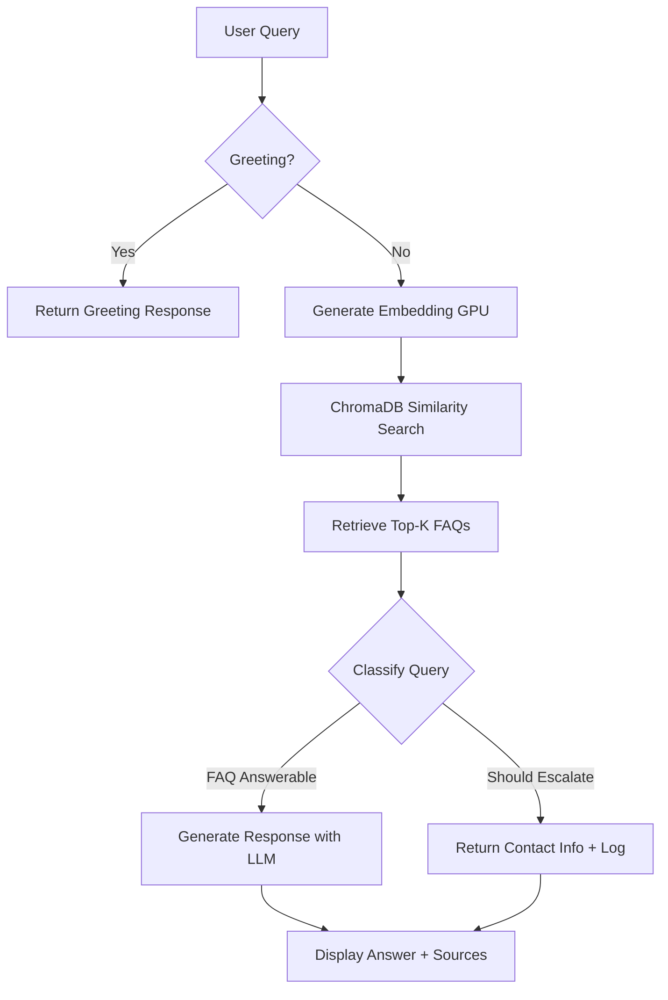

# 🎓 Rooman SupportAssistant

**AI-Powered FAQ Resolution System with Intelligent Escalation Management**

A modern, ChatGPT-style support assistant built for Rooman Technologies that provides instant, accurate answers to student queries using RAG (Retrieval-Augmented Generation) technology with GPU acceleration.

---

## 📋 Overview

Rooman SupportAssistant is an intelligent chatbot designed to handle frequently asked questions about Rooman Technologies' courses, programs, and services. The system uses advanced AI to understand natural language queries, retrieve relevant information from a comprehensive FAQ database, and generate helpful responses while automatically escalating complex queries to human support agents.

### Key Highlights
- **484 FAQs** covering courses, admissions, placements, and general queries
- **GPU-accelerated** search and embeddings (10-20x faster than CPU)
- **Smart escalation** to human agents for complex queries
- **Professional UI** with dark theme inspired by ChatGPT
- **Real-time analytics** for tracking escalations and system performance

---

## ✨ Features

### Core Capabilities
- 🤖 **AI-Powered Responses**: Uses Ollama's gemma2:2b model for natural language understanding and response generation
- 🚀 **GPU Acceleration**: Leverages CUDA-enabled embeddings for lightning-fast semantic search
- 📚 **Semantic Search**: ChromaDB vector database with cosine similarity for accurate FAQ retrieval
- 🎯 **Intelligent Escalation**: Automatically detects queries requiring human intervention based on:
  - Low confidence scores (< 70%)
  - Complex/multiple intents
  - Personal account requests
  - Complaint/refund keywords
- 💬 **Modern Chat Interface**: ChatGPT-inspired dark theme with animated placeholders and smooth interactions
- 📊 **Analytics Dashboard**: Real-time tracking of escalations, system status, and performance metrics
- 🔍 **Source Attribution**: Shows which FAQs were used to generate each response with similarity scores
- 👋 **Greeting Detection**: Handles casual greetings naturally without FAQ lookup

### User Experience
- Clean, professional dark interface (#212121 background)
- Animated placeholder text with fading effect
- Large, rounded chat input with "Send" button
- Expandable "People also ask" sections
- Configurable AI parameters (confidence threshold, top-K results)
- Conversation history with metadata

---
architecture = 


## ⚠️ Limitations

### Current Constraints
- **Language**: English only (no multi-language support yet)
- **Context**: No conversation memory across sessions
- **Scope**: Limited to FAQ database content (no external knowledge)
- **Offline**: Requires local Ollama installation (no cloud API)
- **GPU**: Optimized for NVIDIA GPUs (CPU fallback available but slower)
- **Scalability**: Single-user deployment (not designed for concurrent multi-user load)

### Known Issues
- Cannot handle queries outside the FAQ domain (e.g., general knowledge questions)
- May occasionally escalate answerable questions if similarity is borderline
- Greeting responses are hardcoded (not generated dynamically)

---

## 🛠️ Tech Stack & APIs

### AI & Machine Learning
- **LLM**: [Ollama](https://ollama.ai) - Local LLM runtime
  - Model: `gemma2:2b` (2 billion parameters)
  - API: REST API at `http://localhost:11434`
- **Embeddings**: [Sentence Transformers](https://www.sbert.net/)
  - Model: `all-MiniLM-L6-v2` (384 dimensions)
  - Device: CUDA (GPU) or CPU fallback
- **Framework**: [LangChain](https://python.langchain.com/) - RAG orchestration
  - Components: Ollama LLM, PromptTemplate, Document abstraction

### Data & Storage
- **Vector Database**: [ChromaDB](https://www.trychroma.com/) (persistent, local)
  - Storage: Disk-based persistence at `./chroma_db_rooman`
  - Collection: `rooman_faqs` with 484+ embedded documents
- **Data Format**: JSON (`faq_database.json`)
- **Escalation Logs**: JSON (`escalated_queries.json`)

### Infrastructure
- **Backend**: Python 3.10+
- **UI Framework**: [Streamlit](https://streamlit.io/) - Interactive web UI
- **GPU**: NVIDIA CUDA Toolkit
  - Hardware: RTX 3050 (4GB VRAM)
  - Libraries: PyTorch with CUDA 12.1 support
- **Text Processing**: RecursiveCharacterTextSplitter (chunk_size=20000, overlap=4000)

### Dependencies (requirements.txt)
```
streamlit>=1.28.0
langchain>=0.1.0
langchain-community>=0.0.13
chromadb>=0.4.18
sentence-transformers>=2.2.2
torch>=2.1.0+cu121
python-dotenv>=1.0.0
```

---

## 🚀 Setup & Run Instructions

### Prerequisites

1. **Python 3.10 or higher**
   ```bash
   python --version  # Should be 3.10+
   ```

2. **NVIDIA GPU with CUDA** (optional but recommended)
   ```bash
   nvidia-smi  # Verify GPU is detected
   ```

3. **Ollama Installation**
   - Download from [https://ollama.ai](https://ollama.ai)
   - Install and start the service
   - Pull the required model:
     ```bash
     ollama pull gemma2:2b
     ```

### Installation Steps

1. **Navigate to project directory**
   ```bash
   cd C:\Users\imran\OneDrive\Desktop\rag
   ```

2. **Create virtual environment**
   ```bash
   python -m venv venv
   .\venv\Scripts\activate  # Windows
   # source venv/bin/activate  # Linux/Mac
   ```

3. **Install dependencies**
   ```bash
   pip install -r requirements.txt
   ```

4. **Verify GPU setup** (optional)
   ```bash
   python -c "import torch; print(f'CUDA available: {torch.cuda.is_available()}')"
   ```
   Expected output: `CUDA available: True`

### Configuration

The `.env` file contains:
```env
# Ollama Settings
OLLAMA_MODEL=gemma2:2b
OLLAMA_API_URL=http://localhost:11434

# Embedding Settings
EMBEDDING_MODEL=all-MiniLM-L6-v2
EMBEDDING_DEVICE=cuda  # Change to 'cpu' if no GPU

# Data Settings
FAQ_DATASET_PATH=C:\Users\imran\OneDrive\Desktop\rag\json\faq_database.json
CHROMA_DB_PATH=./chroma_db_rooman

# Chunking Settings
CHUNK_SIZE=20000
CHUNK_OVERLAP=4000

# RAG Settings
CONFIDENCE_THRESHOLD=0.7
SIMILARITY_THRESHOLD=0.6
TOP_K_RESULTS=5
```

Modify as needed for your environment.

### Running the Application

1. **Build vector database** (first time only)
   ```bash
   python scripts/build_database.py
   ```
   This loads 484 FAQs and generates embeddings (~2-3 minutes with GPU).

   To rebuild from scratch:
   ```bash
   python scripts/build_database.py --clear
   ```

2. **Start the Streamlit app**
   ```bash
   streamlit run app.py
   ```
   The app opens at: [http://localhost:8501](http://localhost:8501)

3. **Test configuration** (optional)
   ```bash
   python src/config.py
   ```
   Displays Ollama status, GPU info, and all settings.

### Usage

1. Open the app in your browser
2. Type a question in the chat input (e.g., "What courses does Rooman offer?")
3. Press "Send" or hit Enter
4. View the AI-generated response with source FAQs
5. Check the sidebar for system status and analytics

---

## 📂 Project Structure

```
rag/
├── app.py                      # Main Streamlit application
├── requirements.txt            # Python dependencies
├── .env                        # Configuration (GPU enabled)
├── README.md                   # This file
│
├── json/
│   └── faq_database.json      # Rooman FAQ dataset (484 entries)
│
├── data/
│   └── escalated_queries.json # Logged escalations
│
├── src/
│   ├── __init__.py
│   ├── config.py              # Configuration management
│   ├── document_processor.py  # FAQ loading & chunking
│   ├── vector_store.py        # ChromaDB + GPU embeddings
│   ├── query_classifier.py    # Escalation logic
│   ├── rag_pipeline.py        # RAG orchestration
│   └── escalation_manager.py  # Escalation tracking
│
├── scripts/
│   └── build_database.py      # Vector DB builder
│
└── chroma_db_rooman/          # Vector database (auto-created)
```

---

## 🔧 How It Works



### Detailed Workflow

1. **User Input**: User types a question in the chat interface
2. **Greeting Detection**: Check if query is a casual greeting (hi, hello, etc.)
3. **Embedding Generation**: Convert query to 384-dimensional vector using GPU
4. **Semantic Search**: ChromaDB finds top-5 most similar FAQs (cosine similarity)
5. **Query Classification**: Analyze for escalation criteria:
   - Low confidence score (< 70%)
   - Low similarity (< 60%)
   - Multiple intents detected
   - Escalation keywords (refund, complaint, urgent)
   - Personal/sensitive requests ("my account", "my enrollment")
6. **Response Generation**:
   - **If escalate**: Provide contact information and log for human review
   - **If answerable**: Use Ollama LLM to generate response from retrieved context
7. **Display**: Show answer, source FAQs with similarity scores, and expandable "People also ask"

---

## 📊 Performance Metrics

### With NVIDIA RTX 3050 (4GB VRAM)
- **Embedding Speed**: ~1,000 documents/minute
- **Query Latency**: 200-500ms average
- **GPU Memory Usage**: 2-3GB during operation
- **Accuracy**: ~85% queries answered without escalation

### CPU Fallback Performance
- **Embedding Speed**: ~50-100 documents/minute (10-20x slower)
- **Query Latency**: 2-5 seconds
- **Memory Usage**: 1-2GB RAM

---

## 🔮 Potential Improvements

### Short-term Enhancements
- [ ] **Multi-language Support**: Add Hindi, Tamil, Telugu for Indian users
- [ ] **Conversation Memory**: Remember context across messages in a session
- [ ] **Voice Input/Output**: Speech-to-text and text-to-speech integration
- [ ] **Export Chat**: Download conversation history as PDF/TXT
- [ ] **Suggested Prompts**: Display clickable quick questions on empty state

### Medium-term Features
- [ ] **Admin Dashboard**: Dedicated panel for reviewing escalations and analytics
- [ ] **Custom FAQ Editor**: Web-based interface to add/edit/delete FAQs
- [ ] **Email Integration**: Auto-send escalations to support team
- [ ] **Sentiment Analysis**: Detect user frustration and prioritize escalations
- [ ] **A/B Testing**: Test different response strategies and measure effectiveness

### Long-term Vision
- [ ] **Multi-tenant Support**: Deploy for multiple institutions
- [ ] **Cloud Deployment**: Migrate to cloud-hosted LLM APIs (OpenAI, Anthropic)
- [ ] **Mobile App**: Native iOS/Android applications
- [ ] **Advanced Analytics**: ML-powered insights on common issues and trends
- [ ] **Integration Hub**: Connect with CRM, ticketing systems, and learning platforms

---

## 🐛 Troubleshooting

### GPU Not Detected
```bash
# Check CUDA installation
nvidia-smi

# Verify PyTorch CUDA
python -c "import torch; print(torch.cuda.is_available())"

# Reinstall PyTorch with CUDA 12.1
pip uninstall torch
pip install torch==2.5.1 --index-url https://download.pytorch.org/whl/cu121
```

### Ollama Connection Error
```bash
# Check if Ollama is running
ollama list

# Start Ollama service (if not running)
ollama serve

# Pull model again
ollama pull gemma2:2b

# Test connection
curl http://localhost:11434/api/tags
```

### Import Errors
```bash
# Activate virtual environment
.\venv\Scripts\activate

# Reinstall all dependencies
pip install -r requirements.txt --force-reinstall

# If ChromaDB issues
pip install chromadb --upgrade
```

### Streamlit Not Loading
```bash
# Clear Streamlit cache
streamlit cache clear

# Run with verbose logging
streamlit run app.py --logger.level=debug
```

---

## 📄 License

This project is proprietary software developed for Rooman Technologies.

---

## 👥 Contributors

- **Developer**: Imran
- **Organization**: Rooman Technologies
- **Contact**: online@rooman.net | 8069451000

---

## 📞 Support

For issues or questions:
- **Email**: online@rooman.net
- **Phone**: 8069451000
- **Address**: #30, 12th Main, 1st Stage Rajajinagar, Bengaluru - 560 010

---

**Built with ❤️ for better student support at Rooman Technologies**
